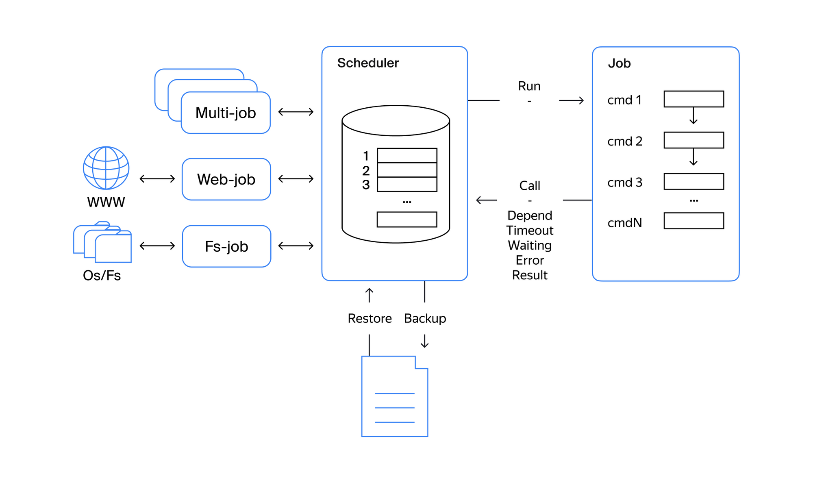

# Планировщик задач для выполнения поступающих задач.

## Описание

**1. `Scheduler`.**

- Планировщик одновременно может выполнять до 10 задач .
- Возможность добавить задачу в планировщик и запустить её в рамках ограничений планировщика и настроек, указанных в задаче.
- При штатном завершении работы планировщик сохраняет статус выполняемых и ожидающих задач.
- После рестарта восстанавливается последнее состояние и задачи продолжают выполняться.

**2. `Job`.**

- У задачи может быть указана длительность выполнения (опциональный параметр). Если параметр указан, то задача прекращает выполняться, если время выполнения превысило указанный параметр.
- У задачи может быть указано время запуска (опциональный параметр). Если параметр указан, то задача стартует в указанный временной период.
- У задачи может быть указан параметр количества рестартов (опциональный параметр). Если в ходе выполнения задачи произошёл сбой или задачи-зависимости не были выполнены, то задача будет перезапущена указанное количество раз. Если параметр не указан, то количество рестартов равно 0.
- У задачи может быть указаны зависимости — задача или задачи, от которых зависит её выполнение (опциональный параметр). Если параметр указан, то задача не может стартовать до момента, пока не будут завершены задачи-зависимости.

Решение полностью строиться на использовании корутин.

Схематично сервис представлен на [диаграмме](schema.png).

